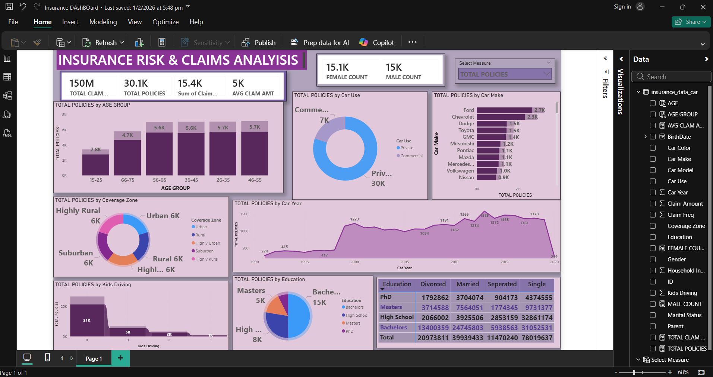

<!DOCTYPE html>
<html lang="en">
<head>
<meta charset="UTF-8">
<meta name="viewport" content="width=device-width, initial-scale=1.0">
<title>Insurance Risk & Claims Analysis Dashboard</title>
</head>

<body>

<h1 align="center">🚗 Insurance Risk & Claims Analysis Dashboard</h1>

A data analytics project built using Power BI to analyze insurance policies, claims, customer demographics, and vehicle information to identify patterns in risk and claims behavior.

<h2>📊 Dashboard Preview</h2>

This interactive dashboard provides insights into insurance policy distribution, claims analysis, and customer demographics. 
It helps identify high-risk segments, claim frequency patterns, and the relationship between policyholder characteristics and claim amounts.

<h2>🧰 Tools & Technologies Used</h2>

<h2>📁 Dataset Description</h2>

The dataset contains insurance policyholder information including personal details, vehicle information, and claim history.

<table border="1" cellpadding="8">
<tr>
<th>Column</th>
<th>Description</th>
</tr>

<tr>
<td>ID</td>
<td>Unique identifier for each policyholder</td>
</tr>

<tr>
<td>BirthDate</td>
<td>Customer date of birth</td>
</tr>

<tr>
<td>Car Make & Model</td>
<td>Vehicle manufacturer and model</td>
</tr>

<tr>
<td>Car Use</td>
<td>Vehicle usage type (Private or Commercial)</td>
</tr>

<tr>
<td>Car Year</td>
<td>Vehicle manufacturing year</td>
</tr>

<tr>
<td>Coverage Zone</td>
<td>Geographic coverage type (Urban, Rural, etc.)</td>
</tr>

<tr>
<td>Education</td>
<td>Policyholder education level</td>
</tr>

<tr>
<td>Gender</td>
<td>Customer gender</td>
</tr>

<tr>
<td>Marital Status</td>
<td>Customer marital status</td>
</tr>

<tr>
<td>Parent</td>
<td>Indicates if the policyholder has children</td>
</tr>

<tr>
<td>Claim Amount</td>
<td>Total claim amount filed</td>
</tr>

<tr>
<td>Claim Frequency</td>
<td>Number of claims made</td>
</tr>

<tr>
<td>Household Income</td>
<td>Income of the policyholder's household</td>
</tr>

<tr>
<td>Kids Driving</td>
<td>Number of young drivers in the household</td>
</tr>

</table>

<h2>📈 Key Dashboard Insights</h2>

<ul>

<li>Total policies analyzed: <b>30K+</b></li>

<li>Total claim amount exceeds <b>150 Million</b></li>

<li>Average claim amount around <b>5K</b></li>

<li>Majority of vehicles are used for <b>private purposes</b></li>

<li>Most policyholders fall between <b>26–65 years</b></li>

<li>Bachelor's degree holders represent the largest policyholder group</li>

<li>Ford, Chevrolet, and Dodge are among the most common vehicle brands</li>

<li>Most households have <b>no kids driving</b>, reducing claim risk</li>

</ul>

<h2>📊 Dashboard Features</h2>

<ul>

<li>Policy distribution by age group</li>

<li>Vehicle usage analysis (Private vs Commercial)</li>

<li>Car make popularity and policy count</li>

<li>Coverage zone distribution</li>

<li>Policy trends by vehicle year</li>

<li>Education level breakdown</li>

<li>Claim frequency and claim amount analysis</li>

</ul>

<h2>🎯 Project Objective</h2>

The goal of this project is to use business intelligence tools to analyze insurance policyholder data and provide insights that help insurers:

<ul>
<li>Identify high-risk customer segments</li>
<li>Understand claim behavior</li>
<li>Improve underwriting strategies</li>
<li>Support data-driven decision making</li>
</ul>

<h3 align="center">⭐ If you like this project, consider giving it a star!</h3>

</body>
</html>
